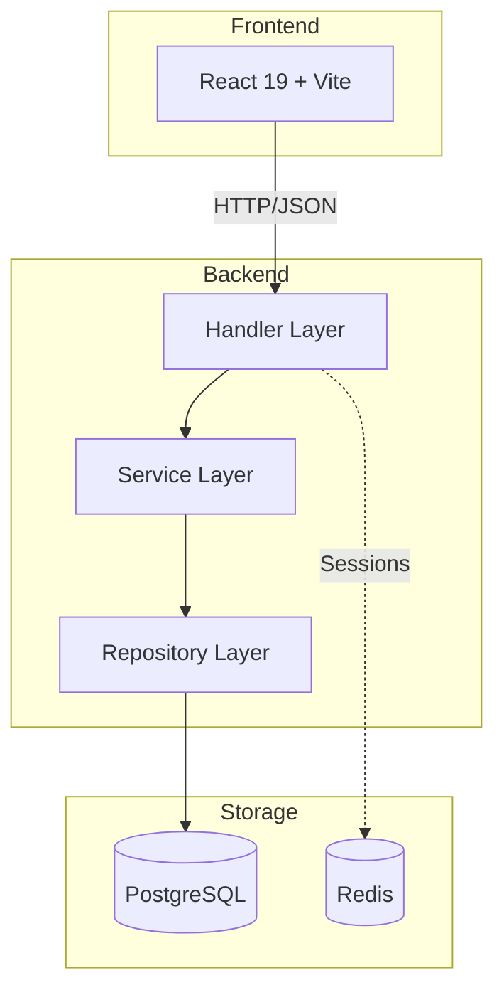
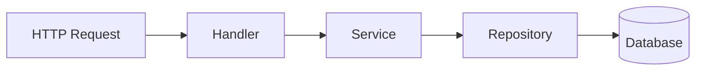
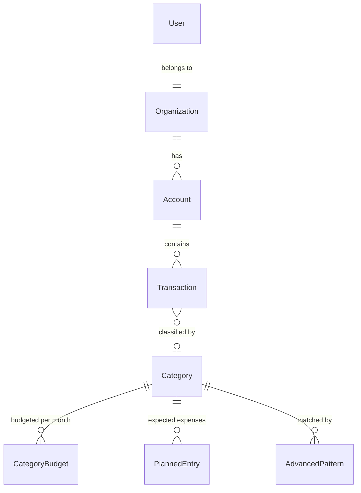
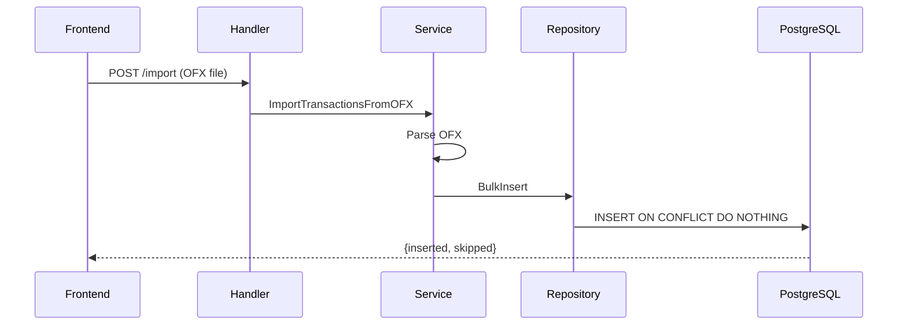
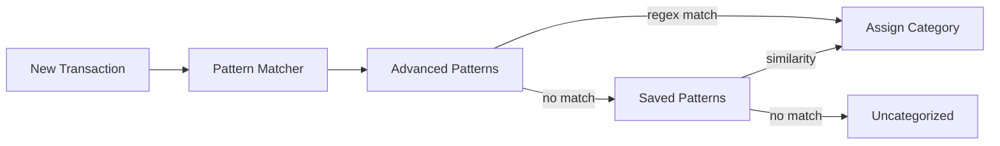

# System Architecture

## Tech Stack

| Layer | Technology |
|-------|------------|
| Backend | Go 1.24, Chi router, SQLX |
| Frontend | React 19, Vite, Tailwind CSS |
| Database | PostgreSQL 16 |
| Cache/Sessions | Redis 7 |
| Observability | Grafana, Loki, OpenTelemetry |

## System Overview

## Backend Layers

| Layer | Responsibility | Location |
|-------|----------------|----------|
| Handler | HTTP parsing, validation, auth | `internal/web/` |
| Service | Business logic, orchestration | `internal/application/` |
| Repository | Data access, single table only | `internal/application/*/repository.go` |

## Domain Model

## API Routes

All financial endpoints under `/financial` require authentication.

| Resource | Endpoints |
|----------|-----------|
| Categories | GET, POST, PATCH `/financial/categories` |
| Accounts | GET, POST `/financial/accounts` |
| Transactions | GET, POST import, PATCH `/financial/accounts/{id}/transactions` |
| Budgets | GET, POST, PUT `/financial/budgets/categories` |
| Patterns | GET, POST, PUT, DELETE `/financial/patterns` |

## Data Flow: OFX Import

## Pattern Matching Flow

## Security

| Aspect | Implementation |
|--------|----------------|
| Authentication | Passwordless magic codes (4-digit, 10min expiry) |
| Sessions | Redis-stored, UUID tokens |
| Headers | `Authorization: Bearer <token>`, `X-Active-Organization: <id>` |
| Data isolation | All queries scoped by organization_id |
