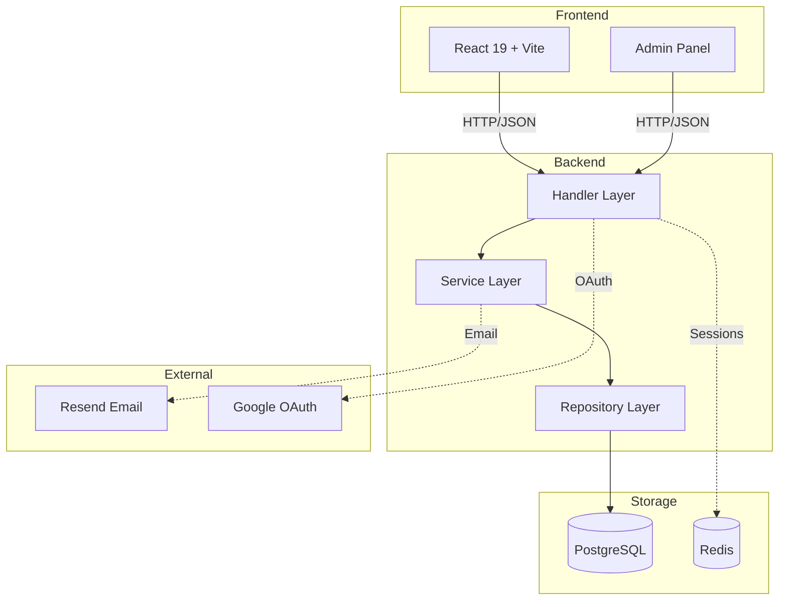
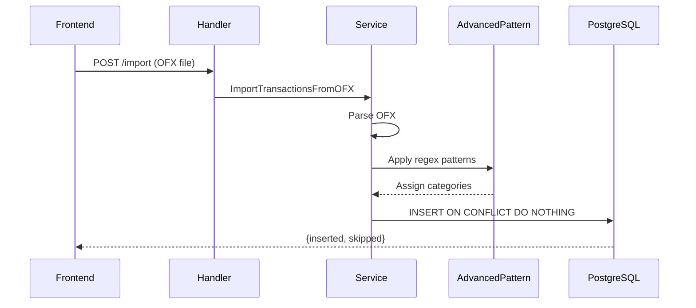
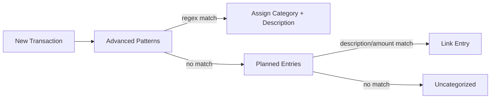

# System Architecture

## Tech Stack

| Layer | Technology |
|-------|------------|
| Backend | Go 1.24, Chi router, SQLX |
| Frontend | React 19, Vite, Tailwind CSS |
| Database | PostgreSQL 16 |
| Cache/Sessions | Redis 7 |
| Observability | Grafana, Loki, OpenTelemetry |

## System Overview

## Backend Layers

| Layer | Responsibility | Location |
|-------|----------------|----------|
| Handler | HTTP parsing, validation, auth | `internal/web/` |
| Service | Business logic, orchestration | `internal/application/` |
| Repository | Data access, single table only | `internal/application/*/repository.go` |

## API Routes

### Public

| Pattern | Purpose |
|---------|---------|
| POST /auth/* | Authentication (request, validate, google, password) |
| POST /invites/accept | Accept org invite |
| POST /system-invites/accept | Accept system invite |
| POST /webhooks/email/inbound | Email webhook (Resend) |

### Protected (Authorization header)

| Pattern | Purpose |
|---------|---------|
| GET /accounts/me/ | Current user info |
| /organizations/{id}/* | Org settings, members, invites |
| /backoffice/* | Admin panel (super admin only) |

### Financial (Authorization + X-Active-Organization)

| Resource | Pattern | Operations |
|----------|---------|------------|
| Categories | /financial/categories/* | CRUD |
| Accounts | /financial/accounts/* | List, create, get details |
| Transactions | /financial/accounts/{id}/transactions/* | List, create, import OFX, update |
| Uncategorized | /financial/transactions/uncategorized | List needing classification |
| Category Budgets | /financial/budgets/categories/* | CRUD, copy, consolidate |
| Legacy Budgets | /financial/budgets/* | CRUD with items (deprecated) |
| Snapshots | /financial/snapshots/* | Historical budget data |
| Planned Entries | /financial/planned-entries/* | CRUD, patterns, match, dismiss |
| Patterns | /financial/patterns/* | CRUD, apply retroactively |
| Savings Goals | /financial/savings-goals/* | CRUD, complete, reopen, contribute |
| Tags | /financial/tags/* | CRUD |
| Transaction Tags | /financial/transactions/{id}/tags | Get, set |
| Income Planning | /financial/income-planning | Report |
| Amazon Sync | /financial/amazon/sync | Chrome extension sync |

## Data Flow: OFX Import

## Pattern Matching Flow

## Security

| Aspect | Implementation |
|--------|----------------|
| Authentication | Magic codes, password, Google OAuth |
| Sessions | Redis-stored, UUID tokens |
| Required Headers | `Authorization: Bearer <token>` |
| Org Context | `X-Active-Organization: <id>` (financial routes) |
| Data isolation | All queries scoped by user_id + organization_id |
| Webhooks | HMAC-SHA256 signature verification (Svix) |
