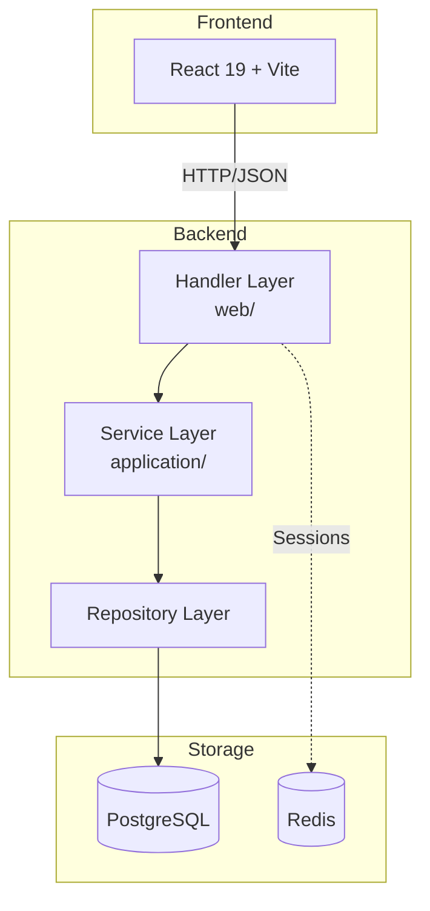
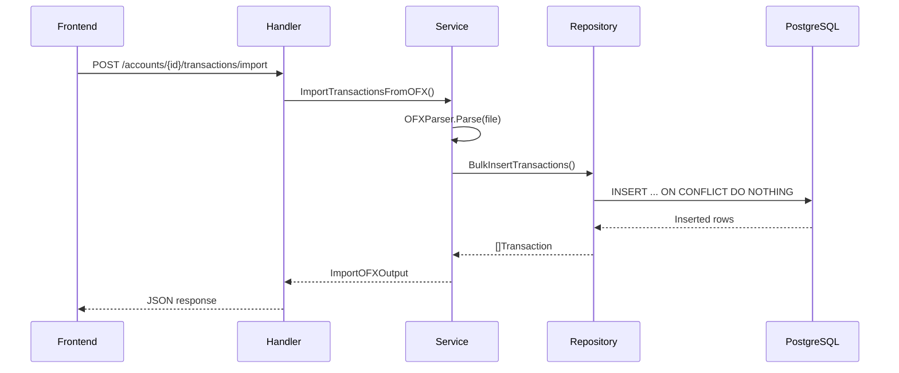
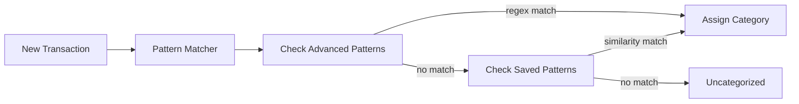

# System Architecture

Celeiro is a personal finance management system with category-centric budgeting.

## Tech Stack

| Layer | Technology |
|-------|------------|
| Backend | Go 1.24, Chi router, SQLX |
| Frontend | React 19, Vite, Tailwind CSS |
| Database | PostgreSQL 16 |
| Cache/Sessions | Redis 7 |
| Observability | Grafana, Loki, OpenTelemetry |

## System Flow



## Backend Layer Pattern

**Handler -> Service -> Repository**

```
internal/
├── application/
│   ├── accounts/      # Auth, users, organizations
│   └── financial/     # Transactions, budgets, patterns (MAIN DOMAIN)
├── web/
│   ├── router.go      # All route definitions
│   ├── accounts/      # Auth handlers
│   └── financial/     # Financial handlers
└── migrations/        # SQL migrations (Goose)
```

### Layer Responsibilities

| Layer | Does | Does NOT |
|-------|------|----------|
| Handler | HTTP parsing, validation, auth check | Business logic |
| Service | Business logic, coordinates repos | Direct SQL |
| Repository | Data access, single table only | Cross-domain JOINs |

### Repository Naming Convention

| Action | Repository Method | Service Method |
|--------|-------------------|----------------|
| Read one | `FetchByID` | `GetByID` |
| Read many | `Fetch*` | `Get*` / `List*` |
| Create | `Insert*` | `Create*` |
| Update | `Modify*` | `Update*` |
| Delete | `Remove*` | `Delete*` |

## Domain Model


### Core Entities

- **User**: Authenticated user with organization membership
- **Organization**: Logical grouping (1:1 with user currently)
- **Account**: Bank account (checking, savings, credit_card, investment)
- **Transaction**: Financial transaction with OFX import support
- **Category**: Transaction classification with icon/color
- **CategoryBudget**: Monthly budget per category
- **PlannedEntry**: Expected expense (recurrent or one-time)
- **AdvancedPattern**: Regex-based automatic categorization

## API Routes

All financial endpoints under `/financial` (require authentication):

### Categories
```
GET    /financial/categories           List categories
POST   /financial/categories           Create category
PATCH  /financial/categories/{id}      Update category
```

### Accounts & Transactions
```
GET    /financial/accounts                              List accounts
POST   /financial/accounts                              Create account
GET    /financial/accounts/{id}/transactions            List transactions
POST   /financial/accounts/{id}/transactions/import     Import OFX
PATCH  /financial/accounts/{id}/transactions/{txId}     Update transaction
GET    /financial/transactions/uncategorized            List uncategorized
```

### Budgets
```
GET    /financial/budgets/categories                    List category budgets
POST   /financial/budgets/categories                    Create category budget
PUT    /financial/budgets/categories/{id}               Update category budget
POST   /financial/budgets/categories/{id}/consolidate   Consolidate month
```

### Patterns
```
GET    /financial/patterns                      List patterns
POST   /financial/patterns                      Create pattern
PUT    /financial/patterns/{id}                 Update pattern
DELETE /financial/patterns/{id}                 Delete pattern
POST   /financial/patterns/{id}/apply-retroactively   Apply to existing txs
```

### Pattern Matching
```
GET    /financial/match-suggestions                     Get match suggestions
POST   /financial/transactions/{id}/apply-pattern       Apply pattern
POST   /financial/transactions/{id}/save-as-pattern     Save tx as pattern
```

## Data Flow Examples

### OFX Import



### Pattern Matching Flow



## Security Model

### Authentication
- Passwordless magic codes (4-digit, 10-minute expiry)
- Session tokens stored in Redis
- Auto-registration on first login

### Authorization Headers
- `Authorization: Bearer <session_token>`
- `X-Active-Organization: <org_id>` (required for /financial endpoints)

### Data Isolation
- All queries scoped by organization_id
- Prepared statements prevent SQL injection
- CORS configured per environment
