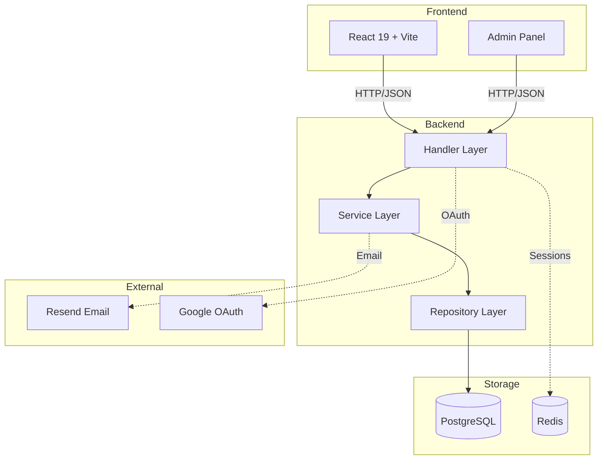
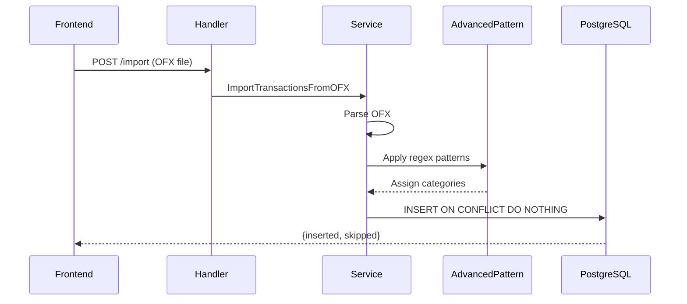
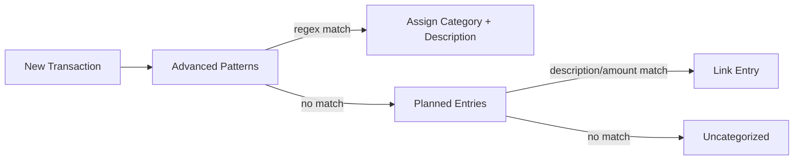
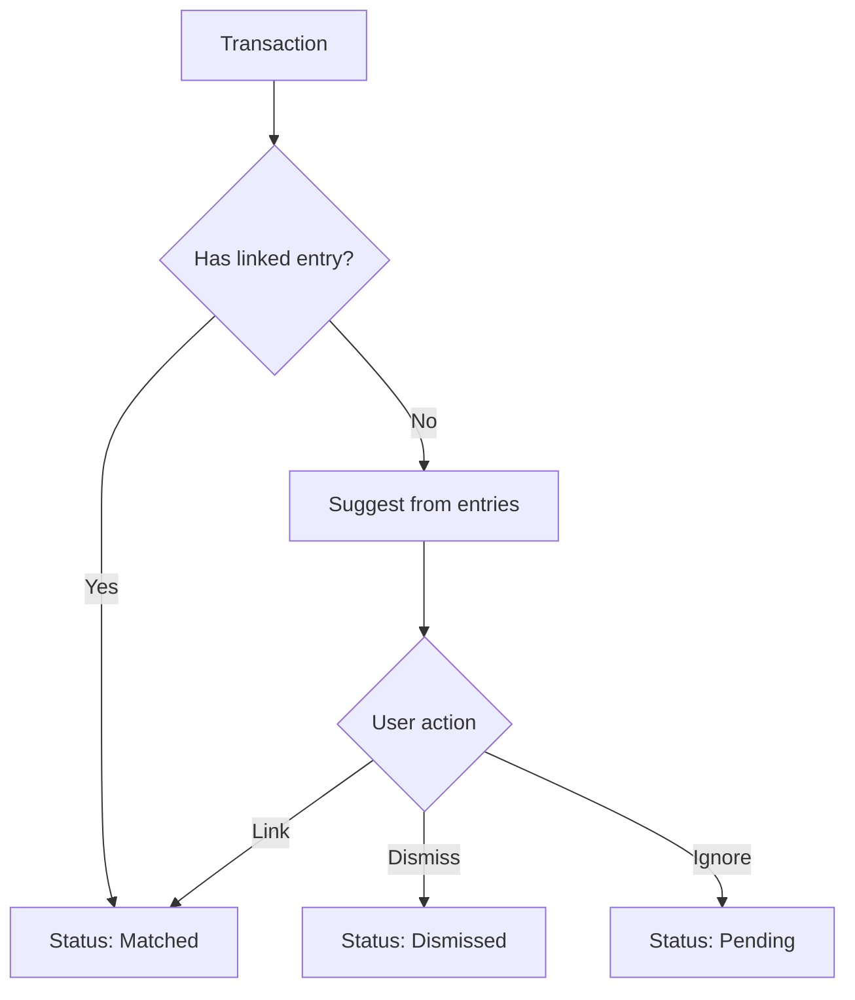

# System Architecture

## Tech Stack

| Layer | Technology |
|-------|------------|
| Backend | Go 1.24, Chi router, SQLX |
| Frontend | React 19, Vite, Tailwind CSS |
| Database | PostgreSQL 16 |
| Cache/Sessions | Redis 7 |
| Observability | Grafana, Loki, OpenTelemetry |

## System Overview

## Backend Layers

| Layer | Responsibility | Location |
|-------|----------------|----------|
| Handler | HTTP parsing, validation, auth | `internal/web/` |
| Service | Business logic, orchestration | `internal/application/` |
| Repository | Data access, single table only | `internal/application/*/repository.go` |

## API Routes

### Public Endpoints

| Path | Method | Purpose |
|------|--------|---------|
| /auth/request/ | POST | Request magic code |
| /auth/validate/ | POST | Validate magic code |
| /auth/google/ | POST | Google OAuth |
| /auth/password/ | POST | Password login |
| /invites/accept | POST | Accept org invite |
| /system-invites/accept | POST | Accept system invite |
| /webhooks/email/inbound | POST | Resend email webhook |

### Protected Endpoints (require Authorization header)

| Resource | Methods | Path |
|----------|---------|------|
| User | GET | /accounts/me/ |
| Organizations | PATCH | /organizations/{id} |
| Org Members | GET | /organizations/{id}/members |
| Org Invites | GET, POST, DELETE | /organizations/{id}/invites |

### Financial Endpoints (require Authorization + X-Active-Organization)

| Resource | Methods | Path |
|----------|---------|------|
| Categories | GET, POST | /financial/categories |
| Category | PATCH, DELETE | /financial/categories/{id} |
| Accounts | GET, POST | /financial/accounts |
| Transactions | GET, POST | /financial/accounts/{id}/transactions |
| Transaction | PATCH | /financial/accounts/{id}/transactions/{txId} |
| Uncategorized | GET | /financial/transactions/uncategorized |
| Category Budgets | GET, POST | /financial/budgets/categories |
| Category Budget | GET, PUT, DELETE | /financial/budgets/categories/{id} |
| Budget Copy | POST | /financial/budgets/categories/copy |
| Planned Entries | GET, POST | /financial/planned-entries |
| Planned Entry | GET, PUT, DELETE | /financial/planned-entries/{id} |
| Entry Status | POST (match/dismiss) | /financial/planned-entries/{id}/* |
| Patterns | GET, POST | /financial/patterns |
| Pattern | GET, PUT, DELETE | /financial/patterns/{id} |
| Savings Goals | GET, POST | /financial/savings-goals |
| Savings Goal | GET, PUT, DELETE | /financial/savings-goals/{id} |
| Goal Actions | POST | /financial/savings-goals/{id}/(complete/reopen/contribute) |
| Tags | GET, POST | /financial/tags |
| Tag | GET, PATCH, DELETE | /financial/tags/{id} |
| Transaction Tags | GET, PUT | /financial/transactions/{id}/tags |
| Income Planning | GET | /financial/income-planning |
| Amazon Sync | POST | /financial/amazon/sync |

## Data Flow: OFX Import

## Pattern Matching Flow

## Planned Entry Matching

## Security

| Aspect | Implementation |
|--------|----------------|
| Authentication | Magic codes, password, Google OAuth |
| Sessions | Redis-stored, UUID tokens |
| Required Headers | `Authorization: Bearer <token>` |
| Org Context | `X-Active-Organization: <id>` (financial routes) |
| Data isolation | All queries scoped by user_id + organization_id |
| Webhooks | HMAC-SHA256 signature verification (Svix) |
