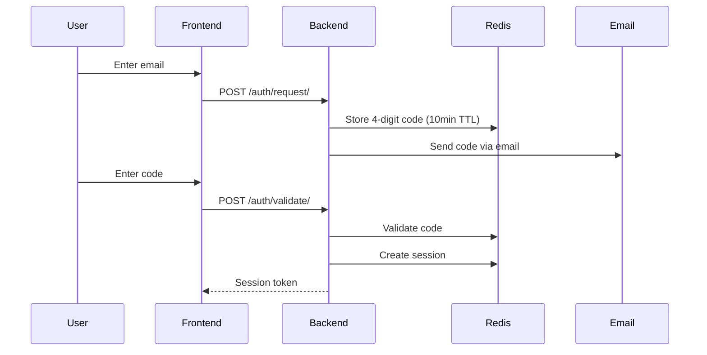

# Authentication

## Overview

Celeiro uses passwordless authentication with magic codes and role-based access control (RBAC).

## Authentication Flow

## Magic Code Details

| Aspect | Value |
|--------|-------|
| Format | 4-digit numeric |
| Expiration | 10 minutes |
| Storage | Redis |
| Usage | Single use (deleted after validation) |

## Auto-Registration

When a new email authenticates:
1. User created with email as name
2. Organization created automatically
3. User linked to org with `regular_manager` role
4. Session created with user + org context

## Roles

| Role | Description |
|------|-------------|
| admin | Full system access (future) |
| regular_manager | Default for new users, can manage org users |
| regular_user | View-only access (future) |

## Required Headers

| Header | Purpose |
|--------|---------|
| `Authorization: Bearer <token>` | Session authentication |
| `X-Active-Organization: <id>` | Required for /financial/* endpoints |

## Session Storage

Sessions are stored in Redis with:
- UUID key for the token
- User ID, email, name
- Organization memberships with permissions
- Automatic expiration

## Security Considerations

| Aspect | Implementation |
|--------|----------------|
| Code brute-force | Limited by 10-minute window |
| Token generation | Cryptographically random UUID |
| Session storage | Redis (not in JWT payload) |
| HTTPS | Required in production |
| Organization isolation | All queries scoped by org_id |
