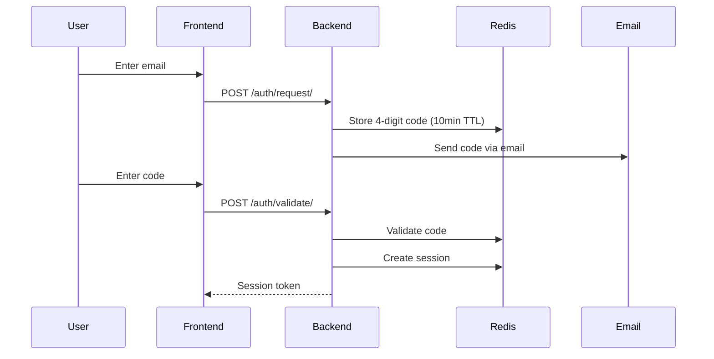

# Authentication

## Overview

Celeiro supports multiple authentication methods with role-based access control (RBAC).

## Authentication Methods

| Method | Endpoint | Description |
|--------|----------|-------------|
| Magic Code | POST /auth/request/ + /auth/validate/ | 4-digit code via email |
| Password | POST /auth/password/ | Email + password |
| Google OAuth | POST /auth/google/ | Google ID token |

## Magic Code Flow

## Magic Code Details

| Aspect | Value |
|--------|-------|
| Format | 4-digit numeric |
| Expiration | 10 minutes |
| Storage | Redis |
| Usage | Single use (deleted after validation) |

## Auto-Registration

When a new email authenticates (any method):
1. User created with email as name
2. Organization created automatically
3. User linked to org with `regular_manager` role
4. Session created with user + org context

## Organization Invitations

Users can be invited to existing organizations:

| Endpoint | Purpose |
|----------|---------|
| POST /organizations/{id}/invites | Create invite (expires in 7 days) |
| POST /invites/accept | Accept invite with token |
| DELETE /organizations/{id}/invites/{inviteId} | Cancel invite |

## Roles

| Role | Description |
|------|-------------|
| admin | Full system access |
| regular_manager | Default for new users, can manage org users |
| regular_user | View-only access |

## Required Headers

| Header | Purpose |
|--------|---------|
| `Authorization: Bearer <token>` | Session authentication |
| `X-Active-Organization: <id>` | Required for /financial/* endpoints |

## Session Storage

Sessions are stored in Redis with:
- UUID key for the token
- User ID, email, name
- Organization memberships with permissions
- Automatic expiration

## Security Considerations

| Aspect | Implementation |
|--------|----------------|
| Code brute-force | Limited by 10-minute window |
| Password storage | bcrypt hashed |
| Token generation | Cryptographically random UUID |
| Session storage | Redis (not in JWT payload) |
| HTTPS | Required in production |
| Organization isolation | All queries scoped by org_id |
| Invite expiration | 7 days, single use |
