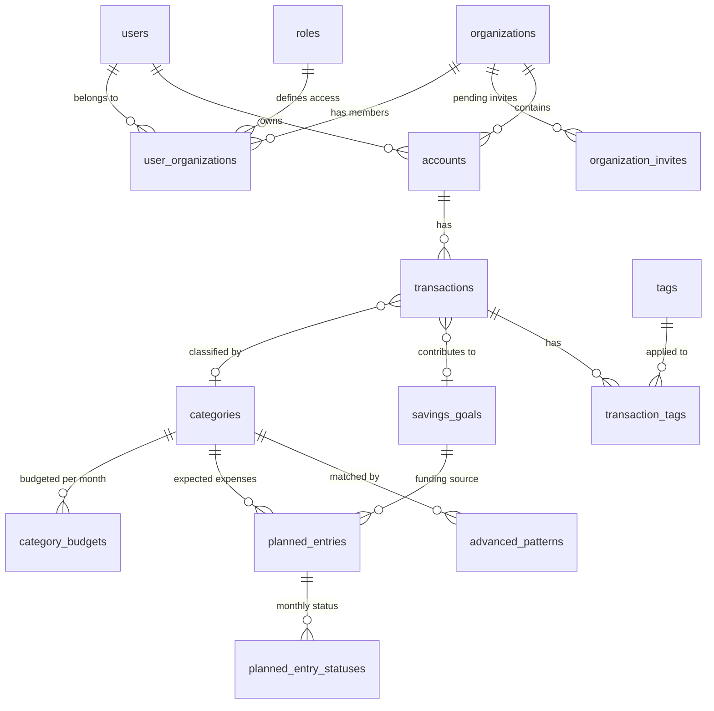

# Database Schema

## Entity Relationships

## Table Overview

### Authentication & Authorization

| Table | Purpose | Key Fields |
|-------|---------|------------|
| users | Authenticated users | email (unique), name, password_hash |
| organizations | Multi-tenant containers | name |
| user_organizations | User-org membership with role | user_id, organization_id, user_role |
| roles | Role definitions | role_name (PK) |
| permissions | Permission definitions | permission (PK) |
| role_permissions | Role-permission mapping | role_name, permission |

### Invitations

| Table | Purpose | Key Fields |
|-------|---------|------------|
| organization_invites | Pending org member invites | email, organization_id, expires_at |
| system_invites | System-wide admin invites | email, expires_at |

### Accounts & Transactions

| Table | Purpose | Key Fields |
|-------|---------|------------|
| accounts | Bank accounts | name, account_type, balance, organization_id |
| transactions | Financial transactions | description, original_description, amount, transaction_date, category_id, savings_goal_id, ofx_fitid, is_classified, is_ignored |

### Categories

| Table | Purpose | Key Fields |
|-------|---------|------------|
| categories | Transaction classifiers | name, icon, color, category_type, is_system, user_id |

### Budgets

**Use `category_budgets` for new code. Legacy tables exist but are deprecated.**

| Table | Status | Purpose |
|-------|--------|---------|
| category_budgets | **Current** | Budget per category per month |
| monthly_snapshots | Current | Historical budget records |
| budgets | Deprecated | Old monthly budget model |
| budget_items | Deprecated | Items in old budget model |

### Planned Entries

| Table | Purpose | Key Fields |
|-------|---------|------------|
| planned_entries | Expected expenses/income | description, amount_min, amount_max, expected_day_start, expected_day_end, is_recurrent, entry_type, category_id, savings_goal_id |
| planned_entry_statuses | Monthly tracking | planned_entry_id, month, year, status, matched_transaction_id |

### Pattern Matching

| Table | Purpose | Key Fields |
|-------|---------|------------|
| advanced_patterns | Regex-based auto-categorization | description_pattern, weekday_pattern, amount_min, amount_max, target_category_id, target_description |
| classification_rules | Simple auto-categorization | description_pattern, amount_min, amount_max, category_id |

### Savings & Tags

| Table | Purpose | Key Fields |
|-------|---------|------------|
| savings_goals | Long-term savings targets | name, target_amount, goal_type (reserva/investimento), status |
| tags | User-defined transaction labels | name, color, user_id, organization_id |
| transaction_tags | Transaction-tag mapping | transaction_id, tag_id |

## Key Design Decisions

| Decision | Rationale |
|----------|-----------|
| Serial IDs (not UUIDs) | 4x smaller, faster joins, human-readable |
| Dual User/Org FK on Accounts | Enables future account sharing |
| FITID uniqueness per account | Prevents OFX import duplicates |
| is_classified flag on transactions | Faster queries than NULL category check |
| System vs user categories | user_id NULL + is_system=true for system categories |
| Dual budget models | Legacy (budgets) + current (category_budgets) |
| Dual description fields | original_description immutable for pattern matching |

## Enums

### Account Types
checking, savings, credit_card, investment

### Budget Types
fixed (uses planned_amount), calculated (sum of entries), maior (MAX of both)

### Transaction Types
debit (money out), credit (money in)

### Category Types
expense, income

### Entry Types (Planned)
expense, income

### Goal Types (Savings)
reserva (short-term), investimento (long-term)

### Planned Entry Status
pending, matched, dismissed, missing

## Important Constraints

- Email uniqueness on users
- UNIQUE (account_id, ofx_fitid) prevents duplicate OFX imports
- Organization isolation via composite FKs (user_id, organization_id)
- Month 1-12, year >= 2000
