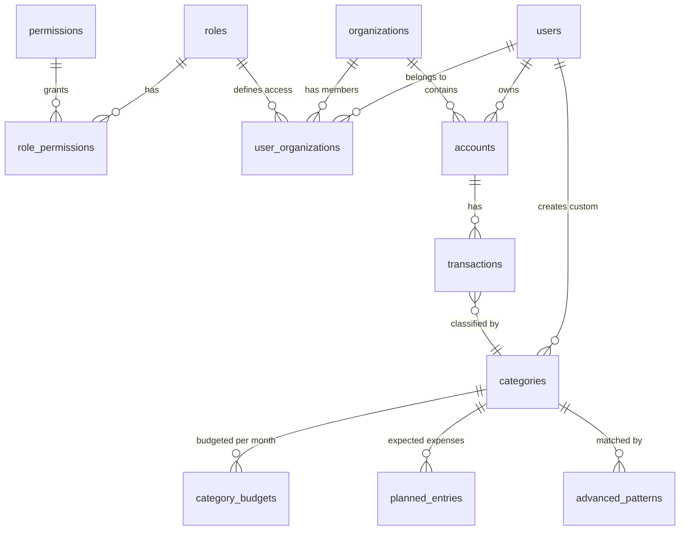

# Database Schema

## Entity Relationships

## Table Overview

### Authentication Layer

| Table | Purpose | Key Fields |
|-------|---------|------------|
| users | Authenticated users | email (unique), name |
| organizations | Multi-tenant containers | name |
| user_organizations | User-org membership with role | user_id, organization_id, user_role |
| roles | Role definitions | role_name (PK) |
| permissions | Permission definitions | permission (PK) |
| role_permissions | Role-permission mapping | role_name, permission |

### Financial Layer

| Table | Purpose | Key Fields |
|-------|---------|------------|
| accounts | Bank accounts | name, account_type, organization_id |
| transactions | Financial transactions | description, amount, transaction_date, category_id, ofx_fitid |
| categories | Transaction classifiers | name, icon, color, is_system |
| category_budgets | Monthly budgets per category | category_id, month, year, budget_type, planned_amount |
| planned_entries | Expected expenses | description, amount, expected_day, is_recurrent |
| advanced_patterns | Regex-based auto-categorization | description_pattern, target_category_id |
| monthly_snapshots | Historical budget records | month, year, total_planned, total_spent |

## Key Design Decisions

| Decision | Rationale |
|----------|-----------|
| Serial IDs (not UUIDs) | 4x smaller, faster joins, human-readable |
| Dual User/Org FK on Accounts | Enables future account sharing |
| FITID uniqueness per account | Prevents OFX import duplicates |
| is_classified flag on transactions | Faster queries than checking NULL category |
| System vs user categories | user_id NULL for system categories |

## Account Types

| Type | Description |
|------|-------------|
| checking | Checking account |
| savings | Savings account |
| credit_card | Credit card |
| investment | Investment account |

## Budget Types

| Type | Calculation |
|------|-------------|
| fixed | Uses planned_amount directly |
| calculated | Sum of planned entries |
| maior | MAX(planned_amount, sum of entries) |

## Transaction Types

| Type | Description |
|------|-------------|
| debit | Money out |
| credit | Money in |

## Indexes

Key performance indexes exist on:
- transactions: account_id + transaction_date, unclassified filter, category + month
- category_budgets: user + org + month + year lookup
- planned_entries: category_id, month/year lookup

## Constraints

- Email validation on users table
- UNIQUE on (account_id, ofx_fitid) prevents duplicate imports
- Budget type must be one of: fixed, calculated, maior
- Month must be 1-12, year must be 2000+
