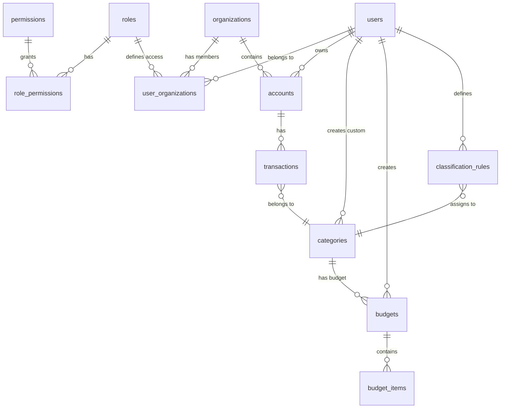

# Unified Database Schema - Celeiro

Complete database schema merging **authentication/authorization system** with **financial management features**.

## Entity Relationship Diagram



## Schema Overview

### **Layer 1: Authentication & Authorization**
```
roles ← role_permissions → permissions
users ← user_organizations → organizations
```

### **Layer 2: Financial Management**
```
organizations → accounts → transactions → categories
users → budgets → budget_items
users → classification_rules
```

## Table Definitions

### 1. Authentication & Authorization Tables

#### roles
```sql
CREATE TABLE roles (
    role_name VARCHAR(255) PRIMARY KEY,
    created_at TIMESTAMP DEFAULT CURRENT_TIMESTAMP,
    updated_at TIMESTAMP DEFAULT CURRENT_TIMESTAMP
);

INSERT INTO roles (role_name) VALUES
('admin'),
('regular_manager'),
('regular_user');
```

#### permissions
```sql
CREATE TABLE permissions (
    permission VARCHAR(255) PRIMARY KEY,
    created_at TIMESTAMP DEFAULT CURRENT_TIMESTAMP,
    updated_at TIMESTAMP DEFAULT CURRENT_TIMESTAMP
);

INSERT INTO permissions (permission) VALUES
('view_organizations'),
('edit_organizations'),
('create_organizations'),
('delete_organizations'),
('view_regular_users'),
('edit_regular_users'),
('create_regular_users'),
('delete_regular_users');
```

#### role_permissions
```sql
CREATE TABLE role_permissions (
    role_permission_id SERIAL PRIMARY KEY,
    role_name VARCHAR(255) NOT NULL REFERENCES roles(role_name),
    permission VARCHAR(255) NOT NULL REFERENCES permissions(permission),
    created_at TIMESTAMP DEFAULT CURRENT_TIMESTAMP,
    updated_at TIMESTAMP DEFAULT CURRENT_TIMESTAMP,
    UNIQUE (role_name, permission)
);

INSERT INTO role_permissions (role_name, permission) VALUES
('regular_manager', 'view_regular_users'),
('regular_manager', 'edit_regular_users'),
('regular_manager', 'create_regular_users'),
('regular_manager', 'delete_regular_users');
```

#### organizations
```sql
CREATE TABLE organizations (
    organization_id SERIAL PRIMARY KEY,
    name VARCHAR(255) NOT NULL,

    -- Address fields (optional)
    address VARCHAR(255) DEFAULT '',
    city VARCHAR(255) DEFAULT '',
    state VARCHAR(255) DEFAULT '',
    zip VARCHAR(255) DEFAULT '',
    country VARCHAR(255) DEFAULT '',
    latitude NUMERIC(10,8) DEFAULT 0,
    longitude NUMERIC(11,8) DEFAULT 0,

    created_at TIMESTAMP DEFAULT CURRENT_TIMESTAMP,
    updated_at TIMESTAMP DEFAULT CURRENT_TIMESTAMP
);
```

**Purpose:** Multi-tenant container. Currently 1 org per user, future: shared organizations.

#### users
```sql
CREATE TABLE users (
    user_id SERIAL PRIMARY KEY,
    email VARCHAR(255) NOT NULL UNIQUE,
    name VARCHAR(255) DEFAULT 'User',
    phone INTEGER DEFAULT 0,

    -- Address fields (optional, for future features)
    address VARCHAR(255) DEFAULT '',
    city VARCHAR(255) DEFAULT '',
    state VARCHAR(255) DEFAULT '',
    zip VARCHAR(255) DEFAULT '',
    country VARCHAR(255) DEFAULT '',
    latitude NUMERIC(10,8) DEFAULT 0,
    longitude NUMERIC(11,8) DEFAULT 0,

    created_at TIMESTAMP DEFAULT CURRENT_TIMESTAMP,
    updated_at TIMESTAMP DEFAULT CURRENT_TIMESTAMP
);

-- Email validation constraint
ALTER TABLE users ADD CONSTRAINT users_email_valid
  CHECK (email ~* '^[A-Za-z0-9._%+-]+@[A-Za-z0-9.-]+\.[A-Z|a-z]{2,}$');
```

#### user_organizations
```sql
CREATE TABLE user_organizations (
    user_organization_id SERIAL PRIMARY KEY,
    user_id INT NOT NULL REFERENCES users(user_id) ON DELETE CASCADE,
    organization_id INT NOT NULL REFERENCES organizations(organization_id) ON DELETE CASCADE,
    user_role VARCHAR(255) NOT NULL REFERENCES roles(role_name),
    created_at TIMESTAMP DEFAULT CURRENT_TIMESTAMP,
    updated_at TIMESTAMP DEFAULT CURRENT_TIMESTAMP,
    UNIQUE (user_id, organization_id)
);
```

### 2. Financial Management Tables

#### accounts
```sql
CREATE TABLE accounts (
    account_id SERIAL PRIMARY KEY,
    user_id INT NOT NULL REFERENCES users(user_id) ON DELETE CASCADE,
    organization_id INT NOT NULL REFERENCES organizations(organization_id) ON DELETE CASCADE,
    name VARCHAR(255) NOT NULL,
    account_type VARCHAR(20) NOT NULL CHECK (account_type IN ('checking', 'savings', 'credit')),

    created_at TIMESTAMP DEFAULT CURRENT_TIMESTAMP,
    updated_at TIMESTAMP DEFAULT CURRENT_TIMESTAMP,

    -- Ensure account belongs to user's organization
    FOREIGN KEY (user_id, organization_id) REFERENCES user_organizations(user_id, organization_id)
);

CREATE INDEX idx_accounts_user ON accounts(user_id);
CREATE INDEX idx_accounts_organization ON accounts(organization_id);
```

**Key Decision:** Accounts linked to both `user_id` and `organization_id` for future sharing.

#### transactions
```sql
CREATE TABLE transactions (
    transaction_id SERIAL PRIMARY KEY,
    account_id INT NOT NULL REFERENCES accounts(account_id) ON DELETE CASCADE,
    category_id INT REFERENCES categories(category_id) ON DELETE SET NULL,

    description TEXT NOT NULL,
    amount DECIMAL(12, 2) NOT NULL,
    transaction_date DATE NOT NULL,
    transaction_type VARCHAR(10) NOT NULL CHECK (transaction_type IN ('debit', 'credit')),

    is_classified BOOLEAN DEFAULT FALSE,
    ofx_fitid VARCHAR(255),
    raw_ofx_data JSONB,

    created_at TIMESTAMP DEFAULT CURRENT_TIMESTAMP,
    updated_at TIMESTAMP DEFAULT CURRENT_TIMESTAMP,

    UNIQUE (account_id, ofx_fitid)
);

-- Performance indexes
CREATE INDEX idx_transactions_account_date ON transactions(account_id, transaction_date DESC);
CREATE INDEX idx_transactions_unclassified ON transactions(account_id) WHERE is_classified = false;
CREATE INDEX idx_transactions_category_month ON transactions(category_id, DATE_TRUNC('month', transaction_date));
CREATE UNIQUE INDEX idx_transactions_ofx_fitid ON transactions(account_id, ofx_fitid);
```

**Key Decisions:**
- `FITID` unique per account (prevents duplicates on re-import)
- `category_id` nullable (transactions start unclassified)
- `is_classified` flag for performance (faster than `WHERE category_id IS NULL`)
- `raw_ofx_data` JSONB for audit trail

#### categories
```sql
CREATE TABLE categories (
    category_id SERIAL PRIMARY KEY,
    user_id INT REFERENCES users(user_id) ON DELETE CASCADE,
    name VARCHAR(255) NOT NULL,
    icon VARCHAR(50) DEFAULT '📁',
    color VARCHAR(7) DEFAULT '#6B7280',
    is_system BOOLEAN DEFAULT FALSE,

    created_at TIMESTAMP DEFAULT CURRENT_TIMESTAMP,
    updated_at TIMESTAMP DEFAULT CURRENT_TIMESTAMP
);

-- System categories (user_id = NULL)
INSERT INTO categories (name, icon, is_system) VALUES
('Alimentação', '🍔', true),
('Transporte', '🚗', true),
('Moradia', '🏠', true),
('Saúde', '💊', true),
('Educação', '📚', true),
('Lazer', '🎮', true),
('Outros', '📦', true);

CREATE INDEX idx_categories_user ON categories(user_id);
```

**Key Decision:** System categories have `user_id = NULL`, user categories linked to specific user.

#### budgets
```sql
CREATE TABLE budgets (
    budget_id SERIAL PRIMARY KEY,
    user_id INT NOT NULL REFERENCES users(user_id) ON DELETE CASCADE,
    category_id INT NOT NULL REFERENCES categories(category_id) ON DELETE CASCADE,
    month INT NOT NULL CHECK (month BETWEEN 1 AND 12),
    year INT NOT NULL CHECK (year BETWEEN 2000 AND 2100),
    amount DECIMAL(12, 2),
    budget_type VARCHAR(20) NOT NULL CHECK (budget_type IN ('fixed', 'calculated', 'hybrid')),

    created_at TIMESTAMP DEFAULT CURRENT_TIMESTAMP,
    updated_at TIMESTAMP DEFAULT CURRENT_TIMESTAMP,

    UNIQUE (user_id, category_id, month, year)
);

CREATE INDEX idx_budgets_user_month ON budgets(user_id, year, month);
CREATE INDEX idx_budgets_category ON budgets(category_id, year DESC, month DESC);
```

#### budget_items
```sql
CREATE TABLE budget_items (
    budget_item_id SERIAL PRIMARY KEY,
    budget_id INT NOT NULL REFERENCES budgets(budget_id) ON DELETE CASCADE,
    description VARCHAR(255) NOT NULL,
    amount DECIMAL(12, 2) NOT NULL CHECK (amount > 0),

    created_at TIMESTAMP DEFAULT CURRENT_TIMESTAMP,
    updated_at TIMESTAMP DEFAULT CURRENT_TIMESTAMP
);

CREATE INDEX idx_budget_items_budget ON budget_items(budget_id);
```

#### classification_rules
```sql
CREATE TABLE classification_rules (
    rule_id SERIAL PRIMARY KEY,
    user_id INT NOT NULL REFERENCES users(user_id) ON DELETE CASCADE,
    category_id INT NOT NULL REFERENCES categories(category_id) ON DELETE CASCADE,
    rule_type VARCHAR(20) NOT NULL CHECK (rule_type IN ('description', 'amount', 'date', 'combined')),
    pattern VARCHAR(255),
    conditions JSONB,
    priority INT NOT NULL DEFAULT 0 CHECK (priority >= 0),
    is_active BOOLEAN DEFAULT TRUE,

    created_at TIMESTAMP DEFAULT CURRENT_TIMESTAMP,
    updated_at TIMESTAMP DEFAULT CURRENT_TIMESTAMP
);

CREATE INDEX idx_rules_active_priority ON classification_rules(user_id, priority ASC) WHERE is_active = true;
```

## Key Design Decisions

### 1. Multi-Tenant via Organizations

**Current State:** 1 user = 1 organization (auto-created on first login)
**Future:** Users can join multiple organizations, share accounts/budgets

**Benefits:**
- Seamless single-user experience now
- Zero friction for multi-user features later
- Clean data isolation

### 2. Serial IDs (not UUIDs)

**Why:**
- 4x smaller storage (4 bytes vs 16 bytes)
- Faster joins (integer comparison vs UUID)
- Human-readable for debugging
- Sequential = better B-tree index performance

**Trade-off:** Can't generate IDs client-side (acceptable for server-only app)

### 3. Dual User/Organization FK on Accounts

```sql
account_id → user_id (owner)
account_id → organization_id (scope)
```

**Why:**
- Enables future account sharing (multiple users, same org)
- Clear ownership (user_id)
- Clear scope (organization_id)

### 4. Passwordless Auth

**Why:**
- Better security (no password leaks)
- Better UX (no password management)
- Simpler code (no password hashing, validation, reset)

### 5. RBAC for Future Expansion

Even though we start with single-user:
- Foundation for multi-user features
- Future: invite users to organization
- Future: shared budgets, collaborative finance

## Migration Strategy

### From Existing Schema → Unified Schema

**Keep:**
- ✅ `roles`, `permissions`, `role_permissions` (unchanged)
- ✅ `organizations`, `users`, `user_organizations` (unchanged)

**Add:**
- 🆕 `accounts` (new, with FK to users + organizations)
- 🆕 `transactions` (new, core feature)
- 🆕 `categories` (new, with system categories seed)
- 🆕 `budgets` (new)
- 🆕 `budget_items` (new)
- 🆕 `classification_rules` (new)

**Migration Order:**
1. Keep existing migrations 00001, 00002
2. Add migration 00003: categories
3. Add migration 00004: accounts
4. Add migration 00005: transactions
5. Add migration 00006: budgets + budget_items
6. Add migration 00007: classification_rules
7. Add migration 00008: indexes

## Queries to Remember

### Get User's Financial Context

```sql
-- Get user with organizations and permissions
SELECT
    u.user_id,
    u.email,
    u.name,
    uo.organization_id,
    uo.user_role,
    COALESCE(rp.permissions, ARRAY[]::text[]) as permissions
FROM users u
LEFT JOIN user_organizations uo USING (user_id)
LEFT JOIN LATERAL (
    SELECT ARRAY_AGG(permission) AS permissions
    FROM role_permissions
    WHERE role_name = uo.user_role
) rp ON true
WHERE u.user_id = $1;
```

### Get Monthly Dashboard

```sql
-- Get all categories with spent vs budgeted
SELECT
    c.category_id,
    c.name,
    c.icon,
    c.color,
    COALESCE(SUM(t.amount), 0) as total_spent,
    COALESCE(b.calculated_amount, 0) as budgeted,
    CASE
        WHEN COALESCE(b.calculated_amount, 0) = 0 THEN 'no_budget'
        WHEN COALESCE(SUM(t.amount), 0) > b.calculated_amount THEN 'over'
        WHEN COALESCE(SUM(t.amount), 0) > b.calculated_amount * 0.9 THEN 'warning'
        ELSE 'ok'
    END as status
FROM categories c
LEFT JOIN transactions t ON t.category_id = c.category_id
    AND t.account_id IN (SELECT account_id FROM accounts WHERE user_id = $1)
    AND DATE_TRUNC('month', t.transaction_date) = DATE_TRUNC('month', CURRENT_DATE)
LEFT JOIN budgets b ON b.category_id = c.category_id
    AND b.user_id = $1
    AND b.month = EXTRACT(MONTH FROM CURRENT_DATE)
    AND b.year = EXTRACT(YEAR FROM CURRENT_DATE)
WHERE c.user_id = $1 OR c.is_system = true
GROUP BY c.category_id, c.name, c.icon, c.color, b.calculated_amount;
```

## Next Steps

See [auth-system.md](./auth-system.md) for authentication details.
See [architecture.md](./architecture.md) for service boundaries.
