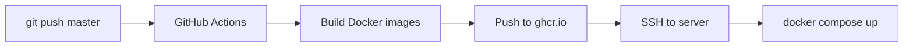
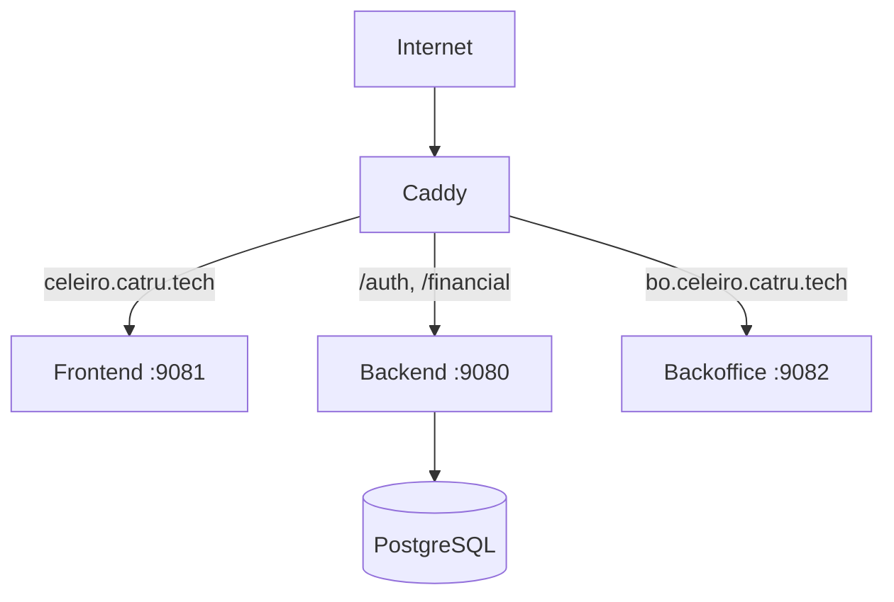

# Deployment

## Deployment Flow

**Code changes**: Push to master triggers automatic deployment via GitHub Actions.

**Infrastructure changes**: Run `make master-staging` from vodsafe repo.

## Architecture

## Environments

| Environment | Frontend | Backoffice | API |
|-------------|----------|------------|-----|
| Staging | celeiro.catru.tech | bo.celeiro.catru.tech | celeiro.catru.tech/financial/* |

## Docker Images

| Image | Description |
|-------|-------------|
| ghcr.io/lucastamoios/celeiro-backend | Go backend |
| ghcr.io/lucastamoios/celeiro-frontend | React frontend (nginx) |
| ghcr.io/lucastamoios/celeiro-backoffice | Admin panel (nginx) |

## Common Operations

| Task | Command |
|------|---------|
| Deploy code | `git push origin master` |
| View logs | `ssh master-staging` then `docker logs -f celeiro_backend` |
| Restart containers | `docker compose pull && docker compose up -d` |
| Deploy Caddyfile | `cd vodsafe && make master-staging` |

## Routing Rules

| Path | Target |
|------|--------|
| /auth/*, /accounts/*, /financial/*, /organizations/*, /invites/*, /webhooks/* | backend:9080 |
| /* (default) | frontend:9081 |

## Environment Variables

Key variables managed via GitHub Secrets and Ansible:
- DATABASE_URL, REDIS_URL
- RESEND_API_KEY, RESEND_WEBHOOK_SECRET
- FRONTEND_URL, GOOGLE_CLIENT_ID

## Adding New Routes

1. Add route in `backend/internal/web/router.go`
2. If new path prefix, add to Caddyfile `@api` matcher
3. Push to master (auto-deploys)
4. If Caddyfile changed, run `make master-staging` from vodsafe

## Backoffice API Pattern

- Frontend calls `/api/*` prefix
- Caddy strips `/api` before proxying to backend
- Backend sees standard paths

## External Services

| Service | Dashboard | Purpose |
|---------|-----------|---------|
| Resend | resend.com/emails | Email sending, inbound webhooks |

## Troubleshooting

| Issue | Cause | Fix |
|-------|-------|-----|
| 405 from nginx | Request hit frontend not backend | Add path to Caddy @api matcher |
| 502 Bad Gateway | Backend container not running | `docker restart celeiro_backend` |
| Changes not reflected | Cached Docker image | `docker compose pull && up -d` |

## Related Repos

| Repo | Purpose |
|------|---------|
| celeiro | Application code |
| vodsafe | Infrastructure (ansible, Caddyfile) |
