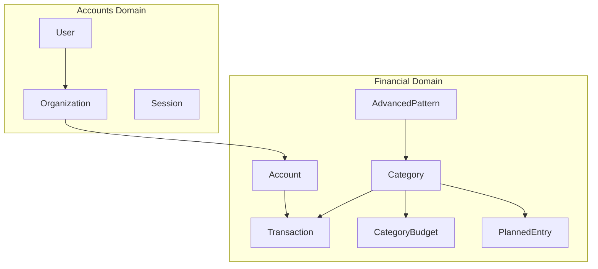
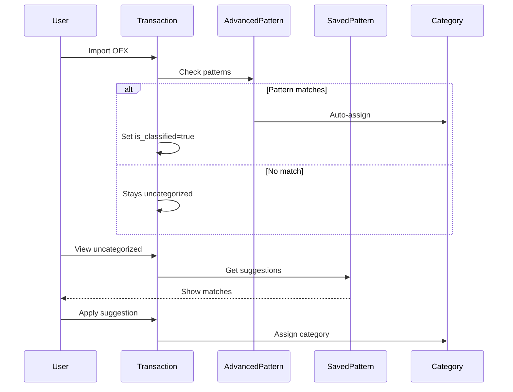

# Domain Guide

How domains interact and what each one manages.

## Domain Overview



## Accounts Domain

**Location**: `backend/internal/application/accounts/`

| Entity | Purpose |
|--------|---------|
| User | Authenticated user with email |
| Organization | Logical grouping (1:1 with user) |
| Session | Redis-backed session token |

### Key Operations

| Operation | Service Method | Notes |
|-----------|---------------|-------|
| Request magic code | `RequestMagicCode` | Sends 4-digit code via email |
| Validate & login | `Authenticate` | Creates user if new email |
| Get current user | `GetByID` | Returns user with org memberships |

---

## Financial Domain

**Location**: `backend/internal/application/financial/`

This is the main domain containing all budgeting functionality.

### Category

Transaction classifier with visual identity.

| Field | Type | Purpose |
|-------|------|---------|
| `name` | string | Display name |
| `icon` | string | Emoji icon |
| `color` | string | Hex color code |
| `is_system` | bool | System-provided vs user-created |

**Key Methods**: `GetCategories`, `CreateCategory`, `UpdateCategory`

### Account

Bank account container for transactions.

| Field | Type | Purpose |
|-------|------|---------|
| `account_type` | enum | checking, savings, credit_card, investment |
| `bank_name` | string | Institution name |
| `balance` | decimal | Current balance |

**Key Methods**: `GetAccounts`, `CreateAccount`

### Transaction

Individual financial transaction.

| Field | Type | Purpose |
|-------|------|---------|
| `description` | string | User-editable description |
| `original_description` | string | Immutable OFX value (for patterns) |
| `amount` | decimal | Transaction amount |
| `category_id` | int | Optional classification |
| `is_classified` | bool | Has been categorized |
| `is_ignored` | bool | Soft delete flag |
| `ofx_fitid` | string | OFX unique identifier |

**Key Methods**:
- `GetTransactions` - List for account
- `GetUncategorizedTransactions` - List needing classification
- `ImportTransactionsFromOFX` - Bulk import from OFX file
- `UpdateTransaction` - Modify description, category, etc.

### CategoryBudget

Monthly budget for a specific category.

| Field | Type | Purpose |
|-------|------|---------|
| `category_id` | int | Target category |
| `month` / `year` | int | Budget period |
| `budget_type` | enum | fixed, calculated, maior |
| `planned_amount` | decimal | Budget amount (for fixed type) |

**Budget Type Logic**:
```go
switch budget_type {
case "fixed":
    return planned_amount
case "calculated":
    return sum(planned_entries)
case "maior":
    return max(planned_amount, sum(planned_entries))
}
```

**Key Methods**: `GetCategoryBudgets`, `CreateCategoryBudget`, `ConsolidateCategoryBudget`

### PlannedEntry

Expected expense or income.

| Field | Type | Purpose |
|-------|------|---------|
| `category_id` | int | Target category |
| `description` | string | Expected description |
| `amount` | decimal | Expected amount |
| `is_recurrent` | bool | Repeats monthly |
| `expected_day` | int | Day of month (1-31) |
| `parent_entry_id` | int | For generated instances |
| `is_saved_pattern` | bool | Used for matching |

**Key Methods**:
- `GetPlannedEntries` - List for category/month
- `CreatePlannedEntry` - Create new entry
- `GenerateMonthlyInstances` - Create instances from recurrent
- `GetSavedPatterns` - Get entries usable as patterns

### AdvancedPattern

Regex-based automatic categorization rule.

| Field | Type | Purpose |
|-------|------|---------|
| `description_pattern` | regex | Match transaction description |
| `weekday_pattern` | regex | Match day of week (0-6) |
| `amount_min/max` | decimal | Amount range |
| `target_category_id` | int | Category to assign |
| `target_description` | string | Description to set |

**Key Methods**:
- `CreateAdvancedPattern` - Create new pattern
- `GetAdvancedPatterns` - List patterns
- `ApplyPatternRetroactivelySync` - Apply to existing transactions

---

## Service Interface

The main service interface shows all available operations.

```go
// backend/internal/application/financial/service.go
type Service interface {
    // Categories
    GetCategories(ctx, params)
    CreateCategory(ctx, params)
    UpdateCategory(ctx, params)
    DeleteCategory(ctx, params)

    // Accounts
    GetAccounts(ctx, params)
    CreateAccount(ctx, params)

    // Transactions
    GetTransactions(ctx, params)
    GetUncategorizedTransactions(ctx, params)
    ImportTransactionsFromOFX(ctx, params)
    UpdateTransaction(ctx, params)

    // Category Budgets
    GetCategoryBudgets(ctx, params)
    CreateCategoryBudget(ctx, params)
    ConsolidateCategoryBudget(ctx, params)

    // Planned Entries
    GetPlannedEntries(ctx, params)
    CreatePlannedEntry(ctx, params)
    GenerateMonthlyInstances(ctx, params)

    // Pattern Matching
    GetMatchSuggestionsForTransaction(ctx, input)
    ApplyPatternToTransaction(ctx, input)
    SaveTransactionAsPattern(ctx, input)

    // Advanced Patterns
    CreateAdvancedPattern(ctx, input)
    GetAdvancedPatterns(ctx, input)
    ApplyPatternRetroactivelySync(ctx, input)

    // Budget Progress
    CalculateBudgetProgress(ctx, input)
    GetIncomePlanning(ctx, input)
}
```

---

## Data Flow: Transaction Categorization



---

## Database Tables by Domain

### Accounts Domain
- `users`
- `organizations`
- `user_organizations`
- `roles`, `permissions`, `role_permissions`

### Financial Domain
- `accounts`
- `transactions`
- `categories`
- `category_budgets`
- `planned_entries`
- `advanced_patterns`
- `monthly_snapshots`
- `budgets`, `budget_items` (legacy)
- `classification_rules` (legacy)
