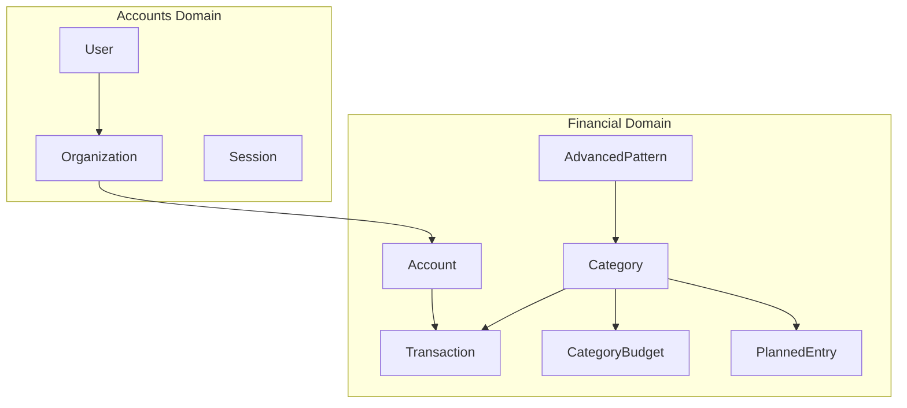
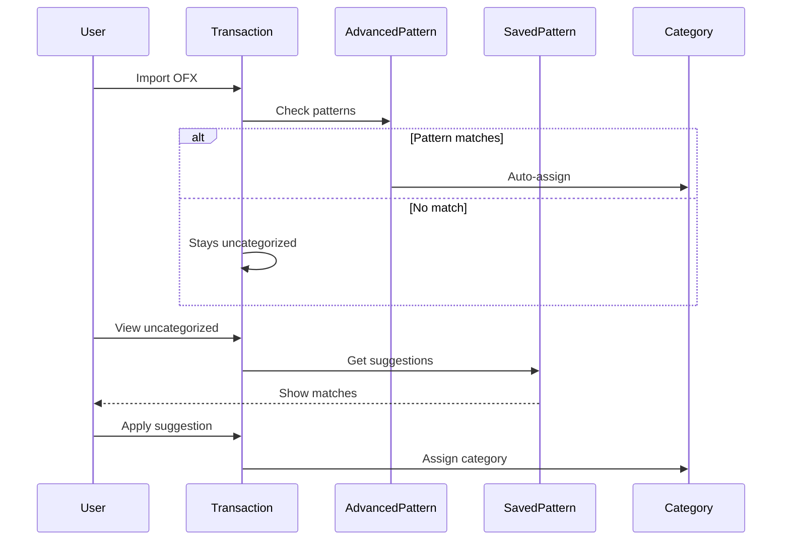

# Domain Guide

## Domain Overview

## Accounts Domain

**Location**: `backend/internal/application/accounts/`

| Entity | Purpose |
|--------|---------|
| User | Authenticated user with email |
| Organization | Multi-tenant container (1:1 with user currently) |
| Session | Redis-backed authentication token |

### Key Operations

| Operation | Description |
|-----------|-------------|
| RequestMagicCode | Sends 4-digit code via email |
| Authenticate | Validates code, creates user if new |
| GetByID | Returns user with org memberships |

## Financial Domain

**Location**: `backend/internal/application/financial/`

### Category

Transaction classifier with visual identity.

| Field | Purpose |
|-------|---------|
| name | Display name |
| icon | Emoji icon |
| color | Hex color code |
| is_system | System-provided vs user-created |

### Account

Bank account container for transactions.

| Field | Purpose |
|-------|---------|
| account_type | checking, savings, credit_card, investment |
| bank_name | Institution name |
| balance | Current balance |

### Transaction

Individual financial transaction.

| Field | Purpose |
|-------|---------|
| description | User-editable description |
| original_description | Immutable OFX value (for pattern matching) |
| amount | Transaction amount |
| category_id | Optional classification |
| is_classified | Has been categorized |
| is_ignored | Soft delete flag |
| ofx_fitid | OFX unique identifier |

### CategoryBudget

Monthly budget for a specific category.

| Field | Purpose |
|-------|---------|
| category_id | Target category |
| month / year | Budget period |
| budget_type | fixed, calculated, or maior |
| planned_amount | Budget amount (for fixed type) |

**Budget Type Calculation**:
- fixed: Uses planned_amount directly
- calculated: Sum of planned entries
- maior: MAX(planned_amount, sum of entries)

### PlannedEntry

Expected expense or income.

| Field | Purpose |
|-------|---------|
| description | Expected description |
| amount | Expected amount |
| is_recurrent | Repeats monthly |
| expected_day | Day of month (1-31) |
| parent_entry_id | For generated monthly instances |
| is_saved_pattern | Used for transaction matching |

### AdvancedPattern

Regex-based automatic categorization rule.

| Field | Purpose |
|-------|---------|
| description_pattern | Regex to match transaction description |
| weekday_pattern | Regex for day of week (0-6) |
| amount_min/max | Amount range filter |
| target_category_id | Category to assign |
| target_description | Description to set |

## Transaction Categorization Flow

## Tables by Domain

### Accounts Domain
- users, organizations, user_organizations
- roles, permissions, role_permissions

### Financial Domain
- accounts, transactions, categories
- category_budgets, planned_entries
- advanced_patterns, monthly_snapshots
