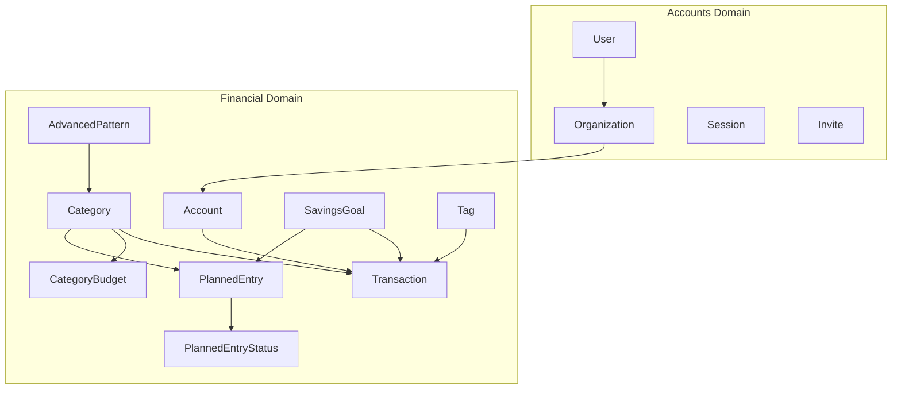
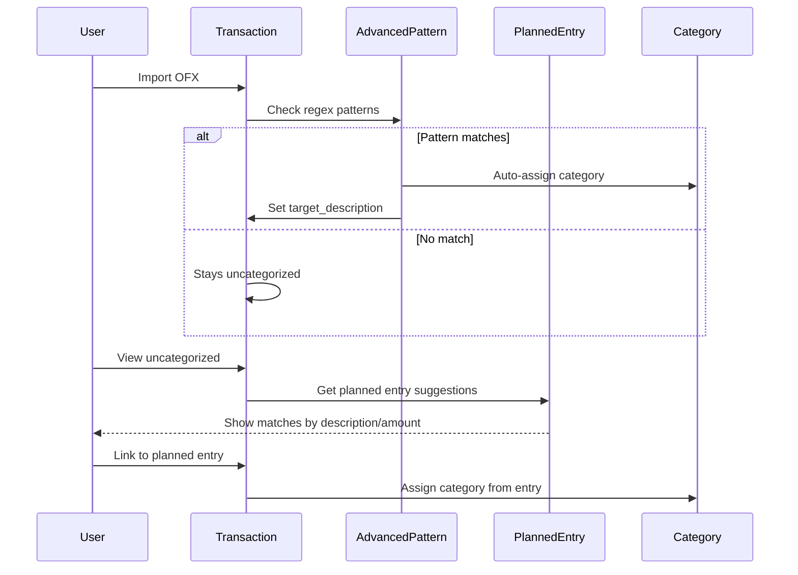
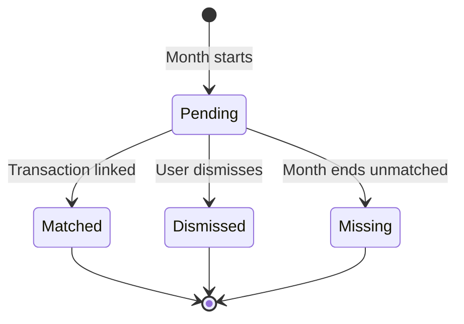

# Domain Guide

## Domain Overview

## Accounts Domain

**Location**: `backend/internal/application/accounts/`

| Entity | Purpose |
|--------|---------|
| User | Authenticated user with email, optional password |
| Organization | Multi-tenant container |
| Session | Redis-backed authentication token |
| OrganizationInvite | Pending member invitation |
| SystemInvite | System-wide admin invitation |

### Key Operations

| Operation | Description |
|-----------|-------------|
| RequestMagicCode | Sends 4-digit code via email |
| Authenticate | Validates code/password/Google, creates user if new |
| GetByID | Returns user with org memberships |
| InviteMember | Creates org invitation |
| AcceptInvite | Joins organization |

## Financial Domain

**Location**: `backend/internal/application/financial/`

### Category

Transaction classifier with visual identity.

| Field | Purpose |
|-------|---------|
| name | Display name |
| icon | Emoji icon |
| color | Hex color code |
| category_type | expense or income |
| is_system | System-provided vs user-created |

### Account

Bank account container for transactions.

| Field | Purpose |
|-------|---------|
| account_type | checking, savings, credit_card, investment |
| bank_name | Institution name |
| balance | Current balance |

### Transaction

Individual financial transaction.

| Field | Purpose |
|-------|---------|
| description | User-editable description |
| original_description | Immutable OFX value (for pattern matching) |
| amount | Transaction amount |
| category_id | Optional classification |
| savings_goal_id | Optional savings goal contribution |
| is_classified | Has been categorized |
| is_ignored | Soft delete flag |
| ofx_fitid | OFX unique identifier |

### CategoryBudget

Monthly budget for a specific category.

| Field | Purpose |
|-------|---------|
| category_id | Target category |
| month / year | Budget period |
| budget_type | fixed, calculated, or maior |
| planned_amount | Budget amount (for fixed type) |

**Budget Type Calculation**:
- fixed: Uses planned_amount directly
- calculated: Sum of planned entries
- maior: MAX(planned_amount, sum of entries)

### PlannedEntry

Expected expense or income ("Entrada Planejada").

| Field | Purpose |
|-------|---------|
| description | Expected description |
| amount_min / amount_max | Expected amount range |
| expected_day_start / end | Day range (1-31) |
| is_recurrent | Repeats monthly |
| entry_type | expense or income |
| category_id | Target category |
| savings_goal_id | Optional linked goal |

### PlannedEntryStatus

Monthly tracking for planned entries.

| Field | Purpose |
|-------|---------|
| planned_entry_id | Parent entry |
| month / year | Period |
| status | pending, matched, dismissed, missing |
| matched_transaction_id | Linked transaction when matched |

### AdvancedPattern

Regex-based automatic categorization rule.

| Field | Purpose |
|-------|---------|
| description_pattern | Regex to match original_description |
| weekday_pattern | Regex for day of week (0-6) |
| amount_min / amount_max | Amount range filter |
| target_category_id | Category to assign |
| target_description | Description to set |

### SavingsGoal

Long-term savings target ("Reserva" or "Investimento").

| Field | Purpose |
|-------|---------|
| name | Goal name |
| target_amount | Target to save |
| current_amount | Current progress |
| goal_type | reserva (short-term) or investimento (long-term) |
| status | active, completed, cancelled |

### Tag

User-defined transaction label.

| Field | Purpose |
|-------|---------|
| name | Tag name |
| color | Hex color code |

## Transaction Categorization Flow

## Planned Entry Lifecycle

## Tables by Domain

### Accounts Domain
- users, organizations, user_organizations
- roles, permissions, role_permissions
- organization_invites, system_invites

### Financial Domain
- accounts, transactions, transaction_tags
- categories, tags
- budgets, budget_items (legacy)
- category_budgets, monthly_snapshots
- planned_entries, planned_entry_statuses
- advanced_patterns, classification_rules
- savings_goals
