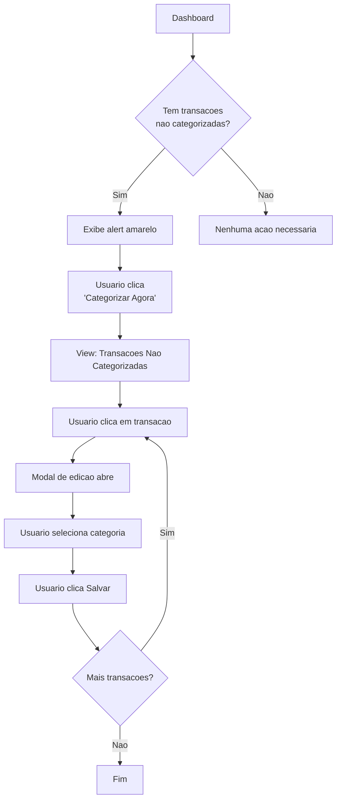
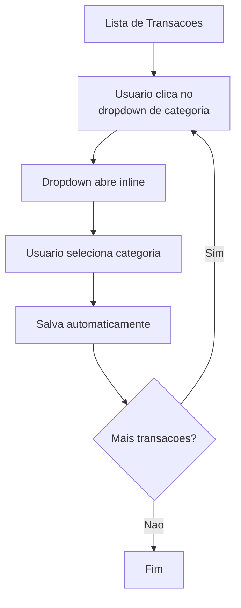
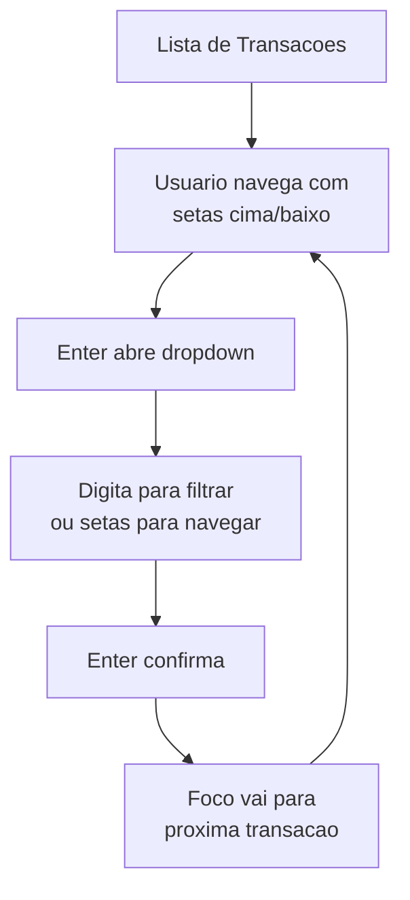
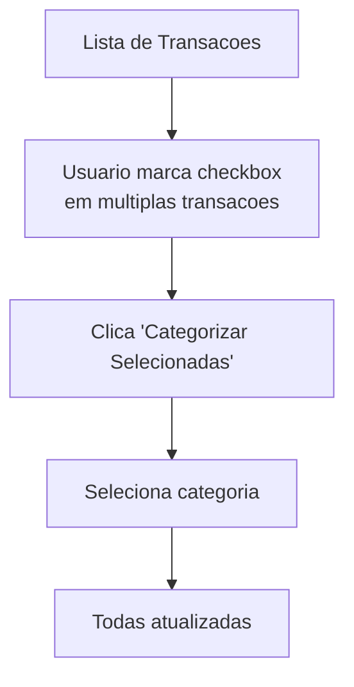

# Fluxo de Categorizacao de Transacoes

## Resumo

O fluxo de categorizacao e a **tarefa mais frequente** do usuario no Celeiro. Cada friccao neste fluxo se multiplica por dezenas ou centenas de transacoes por mes.

## Estado Atual

### Caminho Principal: Dashboard -> Categorizar



### Contagem de Acoes (Por Transacao)

| Acao | Tipo | Cognitivo? |
|------|------|------------|
| 1. Clicar "Categorizar Agora" | Clique | Nao |
| 2. Clicar na transacao | Clique | Sim (localizar) |
| 3. Clicar no dropdown de categoria | Clique | Nao |
| 4. Selecionar categoria | Clique + Decisao | Sim |
| 5. Clicar "Salvar" | Clique | Nao |
| **Total** | **5 cliques** | **2 decisoes** |

**Nota**: O passo 1 so ocorre uma vez por sessao. Para transacoes subsequentes sao 4 cliques.

## Problemas Identificados

### 1. View Escondida

**Problema**: A view "Transacoes Nao Categorizadas" nao aparece no menu principal.

**Impacto**:
- Usuario precisa voltar ao Dashboard para acessar
- Nao ha caminho direto do menu
- Quebra o modelo mental de navegacao

**Evidencia**: No `App.tsx`, a view `uncategorized` nao tem botao correspondente na navbar:
```typescript
// Estas views tem botoes no menu:
'transactions' | 'budgets' | 'patterns' | 'categories' | 'goals'

// Esta view NAO tem botao:
'uncategorized' // So acessivel via Dashboard
```

### 2. Modal Obrigatorio

**Problema**: Para categorizar uma transacao, o usuario DEVE abrir um modal.

**Impacto**:
- Adiciona 2 cliques por transacao (abrir + salvar)
- Interrompe o fluxo visual
- Nao permite categorizacao em lote

**Padrao Esperado**: Dropdown inline ou selecao direta na tabela.

### 3. Ausencia de Atalhos

**Problema**: Nenhum atalho de teclado para:
- Navegar entre transacoes (setas)
- Abrir categorizacao (Enter)
- Confirmar selecao (Enter)
- Cancelar (Escape)

**Impacto**: Usuario obrigado a usar mouse para cada acao.

### 4. Sem Categorizacao em Lote

**Problema**: Nao e possivel selecionar multiplas transacoes e categorizar de uma vez.

**Impacto**: Para 50 transacoes similares (ex: todas do mesmo supermercado), usuario precisa repetir o processo 50 vezes.

### 5. Sem Sugestao de Categoria

**Problema**: O sistema nao sugere categoria baseado em:
- Transacoes similares anteriores
- Padroes existentes
- Descricao da transacao

**Impacto**: Usuario precisa lembrar a categoria correta toda vez.

## Fluxo Proposto

### Opcao A: Categorizacao Inline



**Cliques por transacao**: 2 (dropdown + selecao)
**Reducao**: 60% menos cliques

### Opcao B: Categorizacao com Teclado



**Cliques por transacao**: 0 (tudo via teclado)
**Reducao**: 100% menos cliques

### Opcao C: Categorizacao em Lote



**Cliques para N transacoes**: N+2 (checkboxes + botao + categoria)
**Comparado com atual**: N*4 cliques
**Reducao para 10 transacoes**: 88% menos cliques

## Melhorias Especificas

### Quick Wins (< 1 dia de trabalho)

- [ ] **Adicionar entrada no menu** para "Nao Categorizadas"
  - Mostrar badge com contagem
  - Posicionar apos "Transacoes"

- [ ] **Implementar Escape** para fechar modal
  - Padrao universal, facil de implementar

- [ ] **Implementar Enter** para salvar no modal
  - Reduz 1 clique por transacao

- [ ] **Auto-focus no dropdown** ao abrir modal
  - Usuario pode comecar a digitar imediatamente

### Medio Prazo (1-3 dias)

- [ ] **Dropdown inline** na tabela de transacoes
  - Elimina necessidade de modal
  - Cada linha tem seu proprio dropdown

- [ ] **Navegacao por teclado** na lista
  - Setas para navegar
  - Enter para editar
  - Tab para proximo campo

- [ ] **Sugestao de categoria**
  - Baseado em transacoes similares
  - Mostrar como primeira opcao no dropdown

### Longo Prazo (1 semana+)

- [ ] **Selecao multipla** com checkbox
  - Acao em lote para categoria
  - Acao em lote para exclusao

- [ ] **Integracao com padroes**
  - Ao categorizar, perguntar se quer criar padrao
  - Sugerir regex baseado na descricao

## Metricas de Sucesso

| Metrica | Atual | Meta (Quick Win) | Meta (Completo) |
|---------|-------|------------------|-----------------|
| Cliques por transacao | 4 | 3 | 2 |
| Tempo por transacao | 10s | 7s | 4s |
| Atalhos disponiveis | 0 | 2 | 6+ |
| Categorizacao em lote | Nao | Nao | Sim |

## Prioridade de Implementacao

1. **Altissima**: Adicionar view ao menu (5 min de trabalho, grande impacto)
2. **Alta**: Enter/Escape no modal (30 min, elimina cliques)
3. **Alta**: Auto-focus no dropdown (15 min, melhora fluxo)
4. **Media**: Dropdown inline (4h, elimina modal)
5. **Media**: Navegacao por teclado (4h, power users)
6. **Baixa**: Selecao multipla (8h, casos especificos)

## Codigo Atual vs Proposto

### Atual (UncategorizedTransactions.tsx)

```typescript
// Cada transacao requer clique para abrir modal
<tr onClick={() => openEditModal(tx)}>
  <td>{tx.description}</td>
  <td>{tx.amount}</td>
</tr>

// Modal separado para edicao
<Modal isOpen={editModalOpen}>
  <CategoryDropdown value={category} onChange={setCategory} />
  <button onClick={save}>Salvar</button>
</Modal>
```

### Proposto: Dropdown Inline

```typescript
// Dropdown direto na tabela
<tr>
  <td>{tx.description}</td>
  <td>{tx.amount}</td>
  <td>
    <CategoryDropdown
      value={tx.category}
      onChange={(cat) => saveCategory(tx.id, cat)}
      autoSave={true}
    />
  </td>
</tr>
```

### Proposto: Com Atalhos

```typescript
// Hook para atalhos de teclado
useEffect(() => {
  const handleKeyDown = (e: KeyboardEvent) => {
    if (e.key === 'ArrowDown') selectNextTransaction();
    if (e.key === 'ArrowUp') selectPrevTransaction();
    if (e.key === 'Enter') openCategoryDropdown();
    if (e.key === 'Escape') closeCategoryDropdown();
  };
  window.addEventListener('keydown', handleKeyDown);
  return () => window.removeEventListener('keydown', handleKeyDown);
}, []);
```

## Conclusao

O fluxo de categorizacao atual tem **friccao desnecessaria** que se acumula rapidamente. Com as melhorias propostas:

- **Quick wins** reduzem cliques em 25%
- **Implementacao completa** reduz cliques em 50-60%
- **Com atalhos de teclado** usuarios avancados podem categorizar sem mouse

A prioridade deve ser nas melhorias de alto impacto e baixo esforco (adicionar ao menu, Enter/Escape) antes de investir em mudancas maiores.
