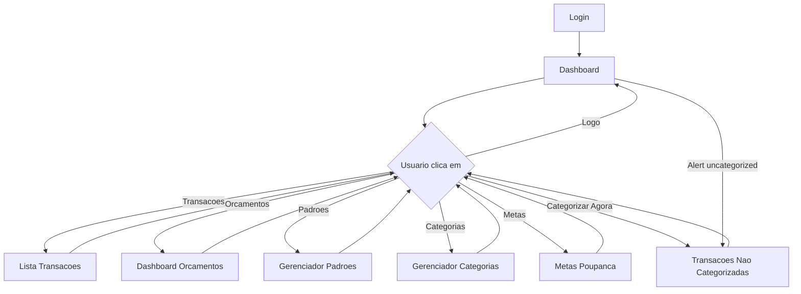

# Estrutura de Navegacao Atual

## Estado Atual

A aplicacao Celeiro utiliza uma **navegacao horizontal superior (top navigation bar)** com os seguintes elementos:

### Componentes da Navegacao

```
+------------------------------------------------------------------+
| Celeiro | Transacoes | Orcamentos | Padroes | Categorias | Metas | [Sair]
+------------------------------------------------------------------+
```

### Itens de Menu

| Item | View ID | Descricao |
|------|---------|-----------|
| Celeiro (Logo) | `dashboard` | Volta ao dashboard |
| Transacoes | `transactions` | Lista de transacoes do mes |
| Orcamentos | `budgets` | Dashboard de orcamentos por categoria |
| Padroes | `patterns` | Gerenciador de padroes regex |
| Categorias | `categories` | CRUD de categorias |
| Metas | `goals` | Metas de poupanca |

### Botao Contextual

- **"Este mes"** - Aparece apenas quando `currentView === 'budgets'`
- Rola a pagina para o card do mes atual

## Fluxo de Navegacao Atual



## Problemas Identificados

### 1. Ausencia de Hierarquia Visual

**Problema**: Todos os itens de menu tem o mesmo peso visual. Nao ha indicacao clara de qual e a acao mais frequente ou importante.

**Impacto**: Usuario precisa escanear toda a barra para encontrar o que procura.

**Evidencia**: Dashboard mostra alert de transacoes nao categorizadas, mas "Transacoes Nao Categorizadas" nao esta no menu principal.

### 2. View Oculta

**Problema**: A view `uncategorized` (transacoes nao categorizadas) nao tem entrada direta no menu. So e acessivel via:
1. Botao "Categorizar Agora" no Dashboard
2. Nao ha caminho de volta direto

**Impacto**: Fluxo principal do usuario (categorizar despesas) esta escondido.

### 3. Ausencia de Atalhos de Teclado

**Problema**: Nenhum atalho de teclado implementado para navegacao.

**Impacto**: Usuarios avancados nao conseguem navegar rapidamente.

**Padrao Esperado**:
- `1-6` para navegar entre secoes
- `Escape` para fechar modais
- `Enter` para confirmar acao primaria

### 4. Estado Nao Persistido

**Problema**: Ao navegar entre secoes, filtros (como mes/ano) sao perdidos.

**Impacto**: Usuario precisa re-selecionar o mes toda vez que muda de view.

### 5. Responsividade Limitada

**Problema**: Menu horizontal nao colapsa em telas pequenas.

**Impacto**: Em mobile, os itens ficam apertados e dificeis de clicar.

## Analise: Top Nav vs Sidebar

### Top Navigation (Atual)

**Pros**:
- Familiar para usuarios
- Menos espaco vertical ocupado
- Bom para poucos itens (5-7)

**Contras**:
- Escala mal com mais itens
- Dificil adicionar sub-menus
- Nao mostra estado/badges facilmente
- Horizontal scrolling em mobile

### Sidebar Navigation (Proposta)

**Pros**:
- Escala bem com muitos itens
- Permite agrupamento hierarquico
- Facilita badges e contadores
- Melhor para apps complexos
- Padrao em apps financeiros (Nubank, Inter, etc)

**Contras**:
- Ocupa espaco horizontal
- Pode ser demais para app simples
- Requer mais trabalho de implementacao

## Recomendacao

Para o Celeiro, considerando:
1. Numero atual de secoes (6) esta no limite do top nav
2. Potencial de crescimento (mais features)
3. Necessidade de mostrar contadores (transacoes pendentes)
4. Padrao de apps financeiros

**Recomendacao**: Manter **top navigation** atual, mas com melhorias:

1. **Adicionar badge de contagem** no item "Transacoes" ou criar item dedicado "Pendentes"
2. **Implementar atalhos de teclado**
3. **Persistir estado entre navegacoes**
4. **Melhorar responsividade mobile**

A migracao para sidebar seria justificada se:
- Numero de secoes ultrapassar 8
- Necessidade de sub-menus
- Feedback negativo de usuarios sobre navegacao atual

## Melhorias Propostas

### Curto Prazo (Quick Wins)

- [ ] Adicionar `aria-current="page"` para acessibilidade
- [ ] Implementar `Escape` para fechar modais
- [ ] Adicionar tooltip com atalho nos itens de menu
- [ ] Mostrar contador de pendentes no menu

### Medio Prazo

- [ ] Implementar atalhos de teclado (1-6)
- [ ] Persistir filtros via URL params ou context
- [ ] Adicionar menu hamburguer para mobile
- [ ] Criar entrada direta para "Nao Categorizadas"

### Longo Prazo

- [ ] Avaliar migracao para sidebar se necessario
- [ ] Implementar preferencias de usuario (tema, layout)
- [ ] Adicionar breadcrumbs para contexto

## Metricas de Sucesso

| Metrica | Atual | Meta |
|---------|-------|------|
| Cliques para categorizar transacao | 4 | 2 |
| Tempo medio por categorizacao | 10s | 5s |
| Atalhos de teclado disponiveis | 0 | 10+ |
| Score de acessibilidade | N/A | 90+ |
